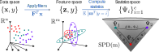

---
jupytext:
  text_representation:
    extension: .md
    format_name: myst
    format_version: 0.13
    jupytext_version: 1.16.2
kernelspec:
  display_name: python3
  language: python
  name: python3
---

# Geometry of SQFA

In this tutorial we provide a brief overview of the geometric perspective
of second-order statistics that underlies SQFA.

## Manifold of SPD Matrices

Symmetric Positive Definite (SPD) matrices are symmetric matrices whose
eigenvalues are all strictly positive. This type of matrix appears in many
applications, such as statistics and machine learning. Some important examples
of SPD matrices are covariance matrices and second moment matrices (when they
are full rank).

SPD matrices have a number of nice algebraic properties, such as being
diagonalizable. Also SPD matrices have a rich geometrical structure, since
the set of $m \times m$ SPD matrices forms a Riemannian manifold
denoted $\mathcal{S}^m_{++}$.

:::{admonition} Riemannian manifolds
Riemannian manifolds are geometric spaces that locally look like Euclidean
spaces, but globally can have a more complex structure. The classical example
of a Riemannian manifold is the surface of a sphere. Locally, if we zoom in
enough the sphere looks like an Euclidean plane, but globally it is not an
Euclidean plane, as illustrated by the fact that we can follow a
"straight trajectory" and come back to the same point.

Riemannian geometry provides the tools to do usual geometric operations in
such spaces, like measuring distances, interpolating, finding averages, etc.

<figure>

  
  <figcaption>
  <b>Riemannian manifolds.</b>
  <i>The surface of the sphere is a non-Euclidean space, if we follow
  a "straight" trajectory we end up at the same spot. Riemannian geometry
  allows us to find quantities such as the average of a set of data points
  in a manifold.</i>
  </figcaption>

</figure>
:::

The geometry of $\mathcal{S}^m_{++}$ (which is shaped like an open cone
in the space of symmetric matrices) is very well studied, and there are
formulas for computing distances, geodesics, means, and other
geometric quantities in this space.
SQFA is based on considering second-order statistics
of the data as points in $\mathcal{S}^m_{++}$, and it leverages this
geometric perspective for learning filters, as explained below.

## Classes as points in SPD manifold

SQFA is a technique for supervised filter learning, or dimensionality
reduction. This means that given a dataset $\{X_t, y_t\}_{t=1}^N$ where
$X_t \in \mathbb{R}^n$ are the data points with $n$ dimensions and $y_t$ are the class
labels, SQFA learns a set of filters, represented by a matrix
$F \in \mathbb{R}^{n \times m}$, $m<n$, where $m$ is the number of filters.
These filters are used to transform the data points $X_t$ into a
lower-dimensional feature space $F^T X_t = Z_t \in \mathbb{R}^m$,
generating the transformed dataset $\{Z_t, y_t\}_{t=1}^N$ of
data features. SQFA is supervised because it uses the class labels
$y_t$ to learn the filters.

In supervised feature learning, the goal is usually to find
features that are discriminative, i.e. that separate the classes well.
Importantly, such methods need to specify the way in which classes are to be
separated. The classical example is
[Linear Discriminant Analysis](https://en.wikipedia.org/wiki/Linear_discriminant_analysis)
(LDA), which learns linear features that maximize the separation between
class means while minimizing the within-class variance in the transformed
dataset $\{Z_t, y_t\}_{t=1}^N$. Thus, LDA maximizes the first-order differences
between classes, by maximizing the Euclidean distances between the class means
$\mu_i = \mathbb{E}[Z | y=i]$, which live in an Euclidean vector space.

First-order differences are the simplest to optimize for, but in real-world
data they may not capture all relevant differences between classes.
One obvious next step is to consider the second-order differences, which
is what SQFA aims to do. A question arises though: how can
we represent second-order differences between classes? Analogous to LDA
using distances between class means in Euclidean space, SQFA
takes a geometric perspective, using distances between second-order
statistics in the manifold $\mathcal{S}^n_{++}$.

More concretely, consider again the dataset $\{X_t, y_t\}_{t=1}^N$,
which has $q$ classes (that is, $y_t \in \{1, 2, \ldots, q\}$) and the
filters $F \in \mathbb{R}^{n \times m}$ that generate the transformed
dataset in the feature space $\{Z_t, y_t\}_{t=1}^N$.
For each class $k$, we can compute the (non-centered) second moment matrix
of the features $\Psi_i = \mathbb{E}[ZZ^T | y=i]$, which contains the second-order
statistics for that class. The matrices $\Psi_i$ are $m \times m$ SPD matrices, and
so the set of $q$ matrices $\{\Psi_i\}_{i=1}^q$ is as a set
of $q$ points in the SPD manifold $\mathcal{S}^m_{++}$.

<figure>

  
  <figcaption>
  <b>Geometry of data statistics.</b>
  <i>SQFA takes a geometric perspective of the second-order statistics of
  the data features as points in the SPD manifold. The locations of the
  points in the SPD manifold depends on the filters that are applied to
  the dataset. We can use Riemannian geometry to measure the
  distances between the statistics.</i>
  </figcaption>

</figure>

The insight behind SQFA is that the larger the Riemannian distance
$d(\Psi_i, \Psi_j)$ between the features generated by the filters $F$
for two classes $i$ and $j$, the more different their second-order
statistics, and therefore the more discriminable these classes are
in the feature space given by $F$.

<figure>

  
  <figcaption>
  <b>Manifold distance and discriminability.</b>
  <i>The idea behind SQFA is that the larger the Riemannian distance
  between the second moment matrices of the classes, the more different their
  second-order statistics, and the more discriminable they are.</i>
  </figcaption>

</figure>

With this in mind, SQFA uses as an objective function the pairwise Riemannian distances
(or squared distances) between the second moment matrices $\Psi_i$ of all classes, 
$U\left(\left\{\Psi_i\right\}_{i=1}^{i=q}\right) = \sum_{i=2}^{q}\sum_{j=1}^{i-1} d(\Psi_i,\Psi_j)$
and it tries to maximize this objective.

## Riemannian metrics relate to discriminability

A key remaining question, however, is how to compute the Riemannian distance
$d(\Psi_i, \Psi_j)$ between two SPD matrices, and in what way this distance
is related to the discriminability of the classes.
In fact, there are several Riemannian metrics compatible with the $\mathcal{S}^m_{++}$
manifold that can be used to measure distances between SPD matrices,
and thus we are faced with the question of which metric to use.

Out of the many metrics compatible with $\mathcal{S}^m_{++}$, the most widely used
one is the Affine-Invariant Riemannian Metric (AIRM). This metric also happens
to be related to the information geometry of 0-mean Gaussian distributions, and
to discriminability as measured by generalized eigenvalues, suggesting that the
AIRM distance is a good proxy for discriminability. The details are
beyond the scope of this tutorial, and further developed in the
[SQFA paper](https://openreview.net/pdf?id=vxdPzM18Xx). The usefulness of the AIRM
distance for learning discriminative features is also empirically validated in
the paper and in the other tutorials.

This does not mean that other metrics are not useful, and different distances
may be suitable for different applications.

In summary, SQFA leverages the geometric structure of the SPD manifold
to learn discriminative features by that maximizing the distances between
the second-order statistics of the classes in $\mathcal{S}^n_{++}$.
In the next tutorials we will learn how to use the `sqfa` package,
and how the features learned by SQFA compare to other methods.

